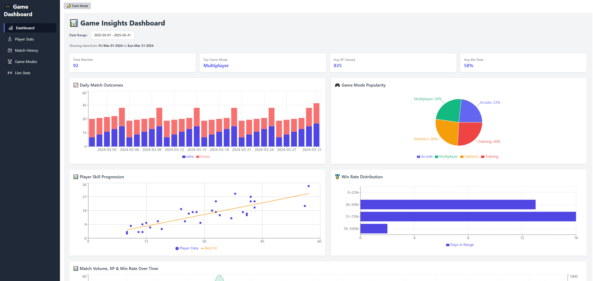
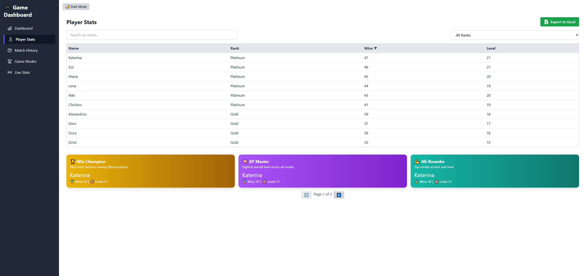
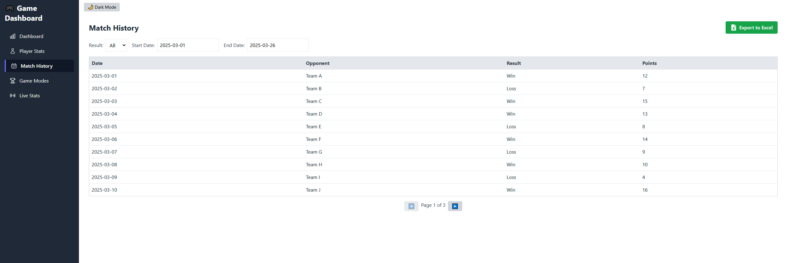
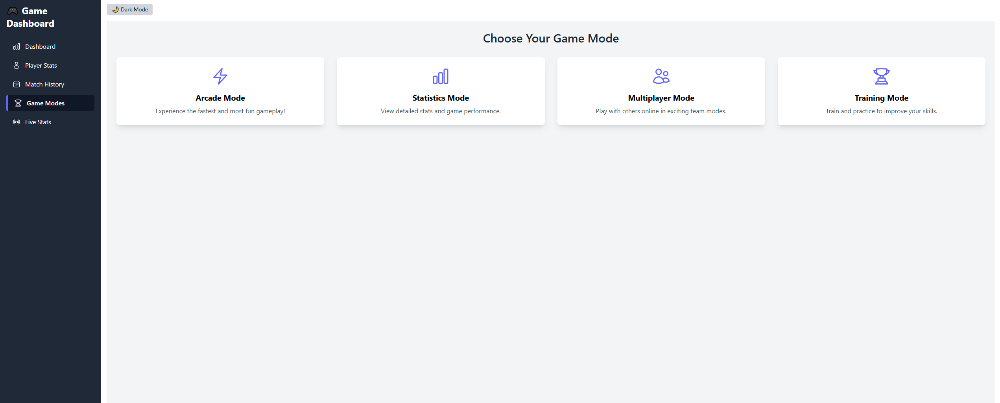
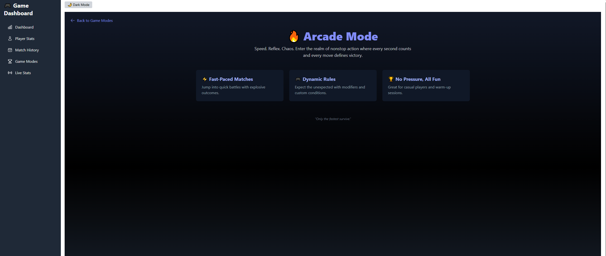
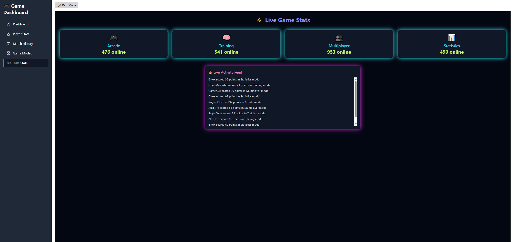

# 🎮 React Game Dashboard

This is a personal project built with **React**, **Tailwind CSS**, and **Recharts**, designed as a game dashboard UI to visualize and interact with gameplay statistics.

## 📊 Features

- 🎯 Player Stats Table (search, filter, sort, pagination)
- 📆 Match History with date filters
- 📈 Dashboard with 5 charts:
  - Daily Wins vs Losses
  - Game Mode Popularity (Pie)
  - Skill Progression (Scatter + Trend Line)
  - Win Rate Buckets
  - XP, Matches & Win Rate Over Time (Composed Chart)
- 📂 Excel Export (table data, filtered or full)
- 🌙 Dark Mode Toggle
- 📡 Live Game Stats with online count + activity feed
- 🕹️ Game Modes Pages (Arcade, Multiplayer, Training, Statistics)
- 🏅 Dynamic badges for top players

## 🖼️ Screenshots

### Dashboard  


### Player Stats  


### Match History  


### Game Modes  


### Arcade Mode  


### Live Stats  


## 🛠️ Getting Started

To run this project locally:

```bash
# 1. Clone the repository
git clone https://github.com/MariaAdvanced/react-charts-ui-project.git
cd react-charts-ui-project

# 2. Install dependencies
npm install

# 3. Start the development server
npm start

# Make sure you're using Node v22.13.0
If you’re using nvm: nvm use 22.13.0

Open [http://localhost:3000](http://localhost:3000) in your browser 

## 💡 Purpose

This project was built to level up my React skills and learn how to build a professional-grade UI for data-rich applications.

It focuses on:
- 🧱 Reusable components & clean structure
- 🎨 UI/UX consistency
- 📊 Handling complex data visualizations
- ⚡ Creating interactive user experiences

## ✨ Author

Made with 💻 by Maria Andritsopoulou (mailto:maria.andri192@gmail.com)  
🔗 GitHub: [github.com/MariaAdvanced](https://github.com/MariaAdvanced)
